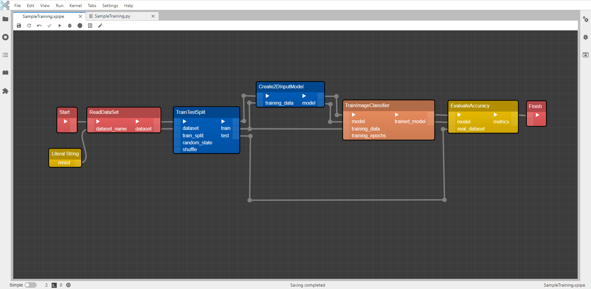

# Keras

## Loading a Keras Model and Performing Inference

##### Example: KerasModelPredict.xircuits

Keras has provided a handful of prebuilt famous models such as the resnet50 and VGG16 and in their API. In Xircuits, you have two ways of loading these models.

- You can use the general `LoadKerasModel` component, all you need to do is supply it a literal string parameter and it will load the config for you. There are also additional parameters that you can supply, but if you would like to have more model specific options, you can choose the 2nd option.

- Xircuits also provides custom Keras model components. Use this if you would like to have more control over your models. An example of this would be mobilenet-based models having `alpha, depth_multiplier, dropout parameters` in addition to the normal `include_top, weights, input_tensor, input_shape, pooling, classes, classifier_activation` parameters.

Both `LoadKerasModel` and custom Keras model components can be linked to `KerasPredict`. You can test this out by linking the model ports between them and supplying an image path to the image you would like to perform inference on.

## Training an Image Classifier Image from Scratch

##### Example: KerasTrainImageClassifier.xircuits

To train an image classifier, you would need a few components.

1. `ReadDataSet`: Keras provides several [prebuilt small datasets](https://keras.io/api/datasets/). Provide the component a literal string and it will download it if you don't haven't downloaded it before.
2. `TrainTestSplit`: The only needed parameter here is the dataset input, however you may want to adjust the default parameters.
3. `Create2DInputModel`: This component will auto adjust according to the input shape from the dataset.
4. `TrainImageClassifier`:This component takes in a model and a dataset split, and trains according to the number of epoch you supply.
5. `EvaluateAccuracy`: Finally, to evaluate your model you can test it out with the test split earlier.

Alternatively, you may also want to perform image augmentation such as `FlattenImageData`. You can place this component between `ReadDataSet` and `TrainTestSplit`. As the input this time is a 1D tensor, use `Create1DInputModel` instead of the Create2DInputModel.

