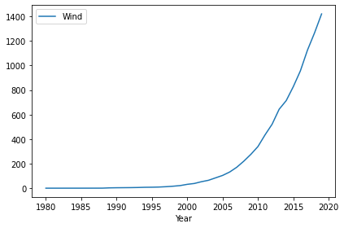
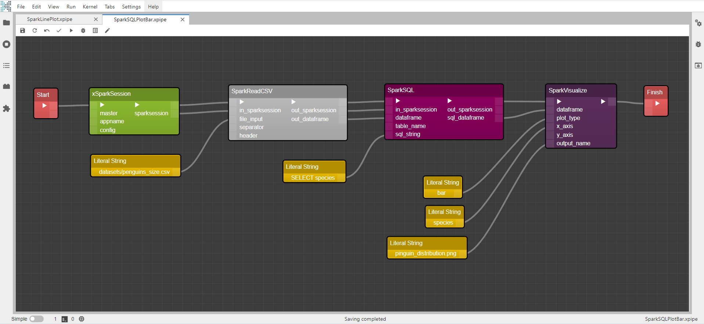
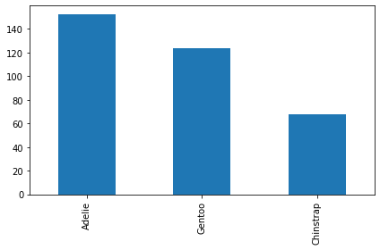

# Spark

Before starting any of these examples, please ensure that your Spark configuration is ready. You may refer to the [Spark setup guide](spark-installation.md). 
## Basic Spark Application


##### Example: SparkLinePlot.xircuits

In this example, you will learn how to start a basic spark application that reads a time series dataset and plots the data.

1. To start a Spark workflow, you will need to start with a `xSparkSession`. All components that require a session can be connected to the session parameter port. 

2. To read a file, the xSparkSession is connected to `SparkReadFile`. In this example, the `LiteralString` path to the time series data, `wind.csv`. is supplied to the file_input InPort. `SparkReadFile` supports csv, parquet, orc, and json data files. 
Note that you may need to upload the file to the HDFS if you're running Spark in a cluster.

3. `SparkReadFile` will output a Spark dataframe which can be then passed to the `SparkVisualize` component. `SparkVisualize` utilizes matplotlib library to plot. You also would need to specify which of the data column to be the X and Y axis.

4. Run using the Xircuits Runner or through your local terminal! It will generate the following output.

```
Executing: xSparkSession
Executing: SparkReadFile
+------+-----------+
|  Year|       Wind|
+------+-----------+
|1980.0|        0.0|
|1981.0|        0.0|
|1982.0|        0.0|
|1983.0|0.029667962|
|1984.0|0.050490252|
|1985.0|0.072761883|
|1986.0| 0.14918872|
|1987.0|0.205541414|
|1988.0|0.342871014|
|1989.0|   2.597943|
|1990.0|     3.5356|
|1991.0|   4.096951|
|1992.0|   4.611373|
|1993.0|    5.55795|
|1994.0|   7.284414|
|1995.0|   7.935523|
|1996.0|   9.288649|
|1997.0|  12.134585|
|1998.0|  16.108642|
|1999.0|   21.24186|
+------+-----------+

Executing: SparkVisualize
```



## Performing Spark SQL Queries



##### Example: SparkSQLPlotBar.xircuits 

The next example show how can you perform sparkSQL queries in Xircuits. 

1. As with the previous example, you would start with a `xSparkSession`.

2. To perform sparkSQL queries, you would require a dataset. In this example, we load the penguin dataset using `SparkReadCSV`. Although not utilized in this .xircuit, `SparkReadCSV` is the more specialized version of `SparkReadData` and allows other csv loading options, such as whether your csv has a header or specifying the data separator.

3. Next is the `SparkSQL` component! The component is smart enough to infer simple SQL queries such as `SELECT species`, however if you would like to use more complex queries, please specify the SQL table name. For example, if you would to run `FROM PenguinTable SELECT species WHERE body_mass_g > 3000`, please supply a `PenguinTable` string to the `table_name` InPort.

4. And that's all you need to do! In this example, the sparkSQL returns a dataframe which is then passed to the `SparkVisualize` component, where a bar chart is generated. The expected result is shown below.


Expected output:

```
Executing: xSparkSession
Executing: SparkReadCSV
+-------+---------+----------------+---------------+-----------------+-----------+------+
|species|   island|culmen_length_mm|culmen_depth_mm|flipper_length_mm|body_mass_g|   sex|
+-------+---------+----------------+---------------+-----------------+-----------+------+
| Adelie|Torgersen|            39.1|           18.7|              181|       3750|  MALE|
| Adelie|Torgersen|            39.5|           17.4|              186|       3800|FEMALE|
| Adelie|Torgersen|            40.3|             18|              195|       3250|FEMALE|
| Adelie|Torgersen|              NA|             NA|               NA|         NA|    NA|
| Adelie|Torgersen|            36.7|           19.3|              193|       3450|FEMALE|
| Adelie|Torgersen|            39.3|           20.6|              190|       3650|  MALE|
| Adelie|Torgersen|            38.9|           17.8|              181|       3625|FEMALE|
| Adelie|Torgersen|            39.2|           19.6|              195|       4675|  MALE|
| Adelie|Torgersen|            34.1|           18.1|              193|       3475|    NA|
| Adelie|Torgersen|              42|           20.2|              190|       4250|    NA|
| Adelie|Torgersen|            37.8|           17.1|              186|       3300|    NA|
| Adelie|Torgersen|            37.8|           17.3|              180|       3700|    NA|
| Adelie|Torgersen|            41.1|           17.6|              182|       3200|FEMALE|
| Adelie|Torgersen|            38.6|           21.2|              191|       3800|  MALE|
| Adelie|Torgersen|            34.6|           21.1|              198|       4400|  MALE|
| Adelie|Torgersen|            36.6|           17.8|              185|       3700|FEMALE|
| Adelie|Torgersen|            38.7|             19|              195|       3450|FEMALE|
| Adelie|Torgersen|            42.5|           20.7|              197|       4500|  MALE|
| Adelie|Torgersen|            34.4|           18.4|              184|       3325|FEMALE|
| Adelie|Torgersen|              46|           21.5|              194|       4200|  MALE|
+-------+---------+----------------+---------------+-----------------+-----------+------+
only showing top 20 rows

Executing: SparkSQL
+-------+
|species|
+-------+
| Adelie|
| Adelie|
| Adelie|
| Adelie|
| Adelie|
| Adelie|
| Adelie|
| Adelie|
| Adelie|
| Adelie|
| Adelie|
| Adelie|
| Adelie|
| Adelie|
| Adelie|
| Adelie|
| Adelie|
| Adelie|
| Adelie|
| Adelie|
+-------+
only showing top 20 rows

Executing: SparkVisualize

```

