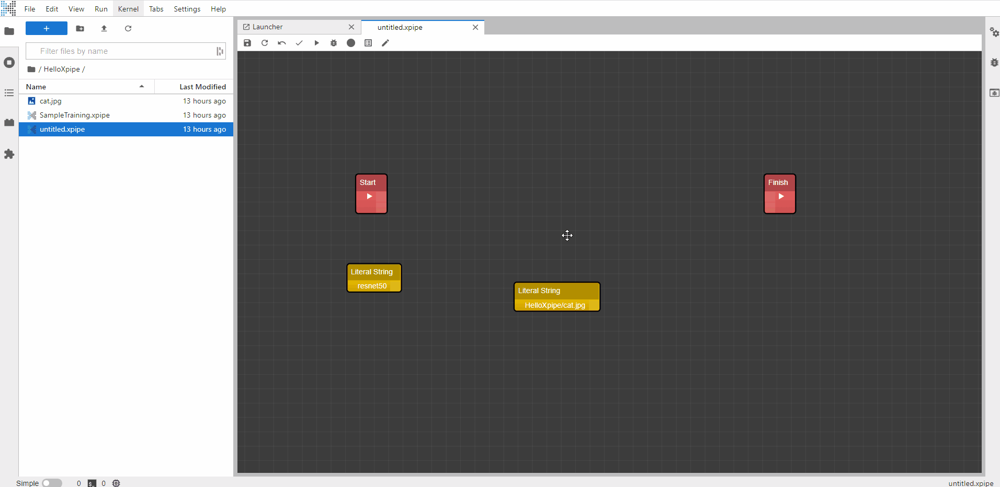
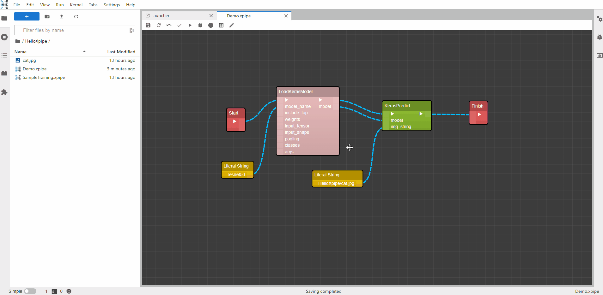
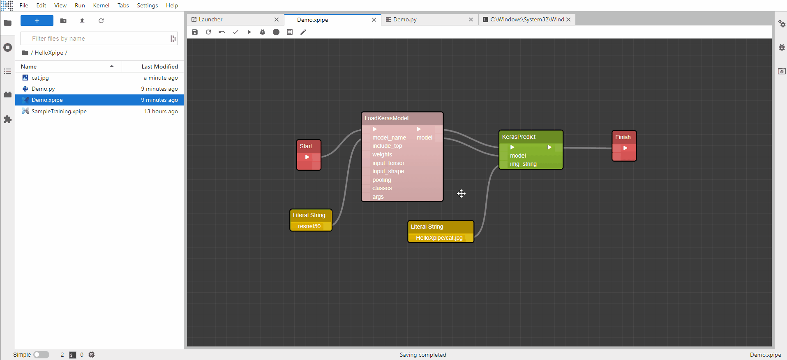

# Overview

Xircuits is a Jupyterlab-based extension that enables visual, low-code, training workflows. It allows anyone to easily create executable python code in seconds.

It is created by data scientists for data scientists. 

## Key Features

  
<b>Rich Xircuits Canvas Interface</b>

    
  
Unreal Engine-like Chain Component Interface  
  </img>

  
Custom Nodes and Ports  
  </img>

  
  
Smart Link and Type Check Logic  
  </img>

  
  
Component Tooltips  
  </img>

  
<b>Code Generation</b>

  Xircuits generates executable python scripts from the workflow. As they're very customizable, you can perform DevOps automation like actions. Consider this Xircuits template which trains an mnist classifier.
  
  

  You can run the code generated python script in Xircuits, but you can also take the same script to train 3 types of models in one go using bash script:

    TrainModel.py --epoch 5 --model "resnet50"
    TrainModel.py --epoch 5 --model "vgg16"
    TrainModel.py --epoch 5 --model "mobilenet"

<b>Famous Python Library Support</b>

Xircuits is built on top of the shoulders of giants. Perform ML and DL using Tensorflow or Pytorch, accelerate your big data processing via Spark, or perform autoML using Pycaret. We're constantly updating our Xircuits library, so stay tuned for more!

Didn't find what you're looking for? Creating Xircuits components is very easy! If it's in python - it can be made into a component. Your creativity is the limit, create components that are easily extendable!

<b>Effortless Collaboration</b>

Created a cool Xircuits workflow? Just pass the .xircuits file to your fellow data scientist, they will be able to load your Xircuits canvas instantly.

Created a cool component library? All your colleagues need to do is to drop your component library folder in theirs and they can immediately use your components.

And many more.
## Workflow
1. Create a new Xircuits from the Jupyterlab launcher or open an existing .xircuits file.

2. Drag components from the Xircuits Component Tray to form your training workflow. Share data among your components using the in and out ports.

3. Press Compile button! The Xircuits will compile the components into a working python code.

4. Run the compiled python code using your own terminal or use our Output Viewer. 

